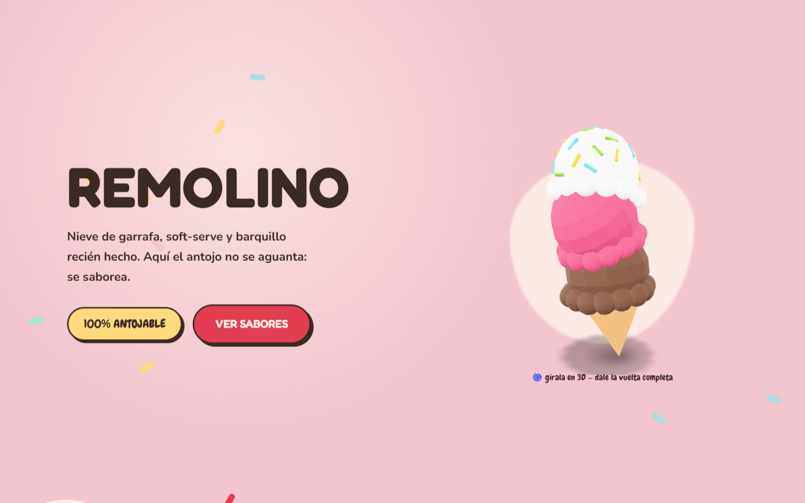
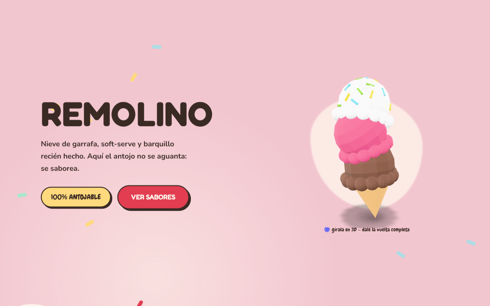

# REMOLINO — Heladería artesanal · Nieve de garrafa

**Ver en vivo → [https://b0b1a6ae23.github.io/remolino-heladeria/](https://b0b1a6ae23.github.io/remolino-heladeria/)**


Landing de heladería construida **sin GSAP**: un sampler de tecnologías
alternativas — anime.js v4, Zdog, Vanilla-Tilt, parallax CSS puro y un helado 3D
girable con `<model-viewer>`.

| Hero | Sección |
| --- | --- |
|  |  |

## Técnicas

- **anime.js 4** (sintaxis nueva: `animate(target, opts)`, `spring()` como función,
  `onScroll` con container): timelines, staggers, draggable y morph SVG.
- **Zdog** para ilustración pseudo-3D animada (gotcha: Zdog reescribe el style
  inline del canvas — el tamaño se doma con CSS `!important` + `aspect-ratio`).
- **`<model-viewer>` 4.x** con GLB real servido localmente: helado 3D que se puede
  girar con el dedo/cursor (`touch-action="pan-y"` para no bloquear el scroll móvil).
- **Vanilla-Tilt** en cards (`max-glare`, `gyroscope:false`).
- Rig de parallax **CSS puro** estilo Keith Clark (`perspective: 1px`) solo desktop.

## Cómo correr

```bash
npx http-server . -p 8080
```

## Licencia

Código bajo licencia [MIT](LICENSE). **REMOLINO** es una marca ficticia creada para demostrar trabajo de portafolio; cualquier parecido con un negocio real es coincidencia. Los recursos de terceros (fotografías, videos y modelos 3D) conservan la licencia original de sus autores — ver Créditos.

## Créditos

Fotografía: [Pexels](https://www.pexels.com) · Modelo 3D: "Triple Scoop Ice Cream"
de Jarlan Perez (CC-BY) vía [Poly Pizza](https://poly.pizza).

---
**Ángel Josué García Cantero** · Serie *páginas-película*.